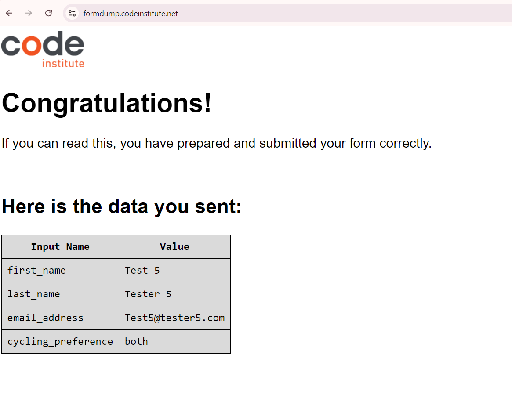

## Project 01 Submission

Student: Guilherme Santos Brito,

The intent of the project is to build an Website for a Charity Project who cycles with the elderly in parks.
This is an existing charity, which I volunteer in the city of Malmö-Sweden. 
There are many more around the world, from which I took the reference images from.

## Release History
Version history:

**September, 26 - 2024,** First upload to Git

## Testing and Code Validation

1) Responsiveness

Checked via Chrome DevTools
a) Laptop

b) Iphone 14 Pro Max

c) Galaxy Z Fold

2) Lighthouse

Checked via Chrome for Desktop, accessed via DevTools:

First run detected a slow performance, due to high resolution images, which were corrected and improved the performance from 68 to 98 points!

3) Bugs

 No identified bugs

4) Code Validation

a) HTML, via https://validator.w3.org

No errors identified per the evidence below:

1 - Index

2 - Gallery

3 - Signup

b) CSS, via https://jigsaw.w3.org/css-validator/

No errors identified per the evidence below:

1 - Index

2 - Gallery

3 - Signup

5) Browser Compatibility

Tested on following Navigators: 

a) Google Chrome and,

b) Microsoft Edge

6) Features

All links, buttons and forms were manually tested.

As an illustrative example, a picture of the form signup entries below:

7) References and Credits

a) Page designed upon the reference code of Code Institute "Love Running" example website

b) Images taken from https://cyclingwithoutage.org/

c) icons from: https://fontawesome.com/

8) Deployment

The site was deployed to GitHub pages. The steps to deploy are as follows:

a) In the GitHub repository, navigate to setting tab

b) From the source section drop-down menu, select the Master Branch

c) Once the master branch has been selected, the page provided the link to the completed website

